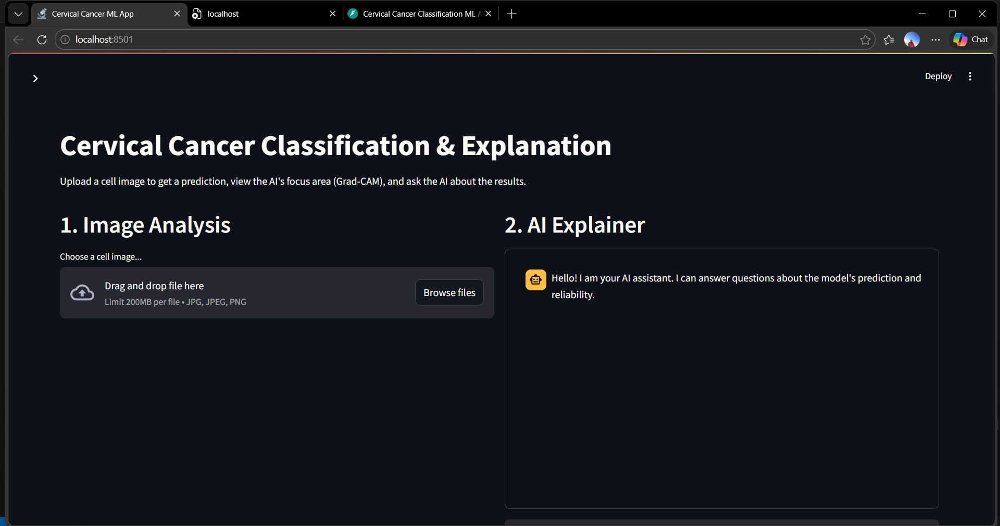
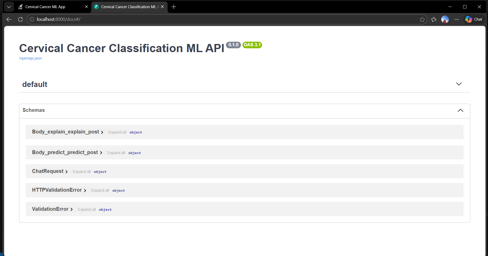
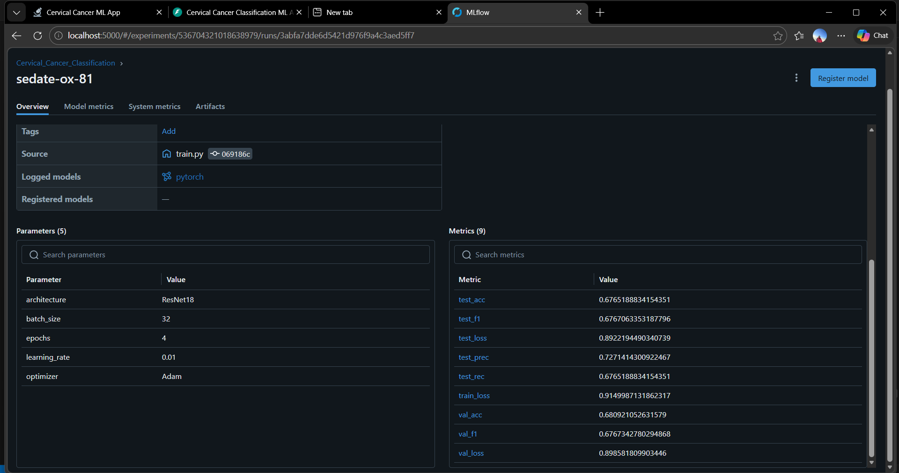
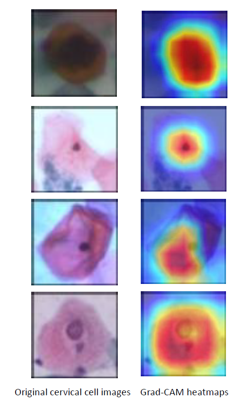

# Cervical Cancer Classification — End-to-End MLOps Project

An end-to-end Machine Learning project that trains a deep learning model, explains its predictions visually (Grad-CAM), tracks experiments (MLflow), versions data (DVC), serves everything via a REST API (FastAPI), and integrates a conversational AI interface (LLaMA 3 / OpenAI) to make model predictions understandable for non-technical users.

---

# Project Demonstration

A short walkthrough of the system showing:

- Streamlit interface for image upload
- FastAPI backend endpoints
- Grad-CAM visual explanations
- MLflow experiment tracking
- AI chatbot interaction


[](docs/Explanatory_Video.mp4)

Click the image above to watch the full system walkthrough.

---


# Project Overview

This project demonstrates a production-style **MLOps pipeline for medical image classification** using cervical cancer cell images. The model classifies images into **five cell categories** using **transfer learning with ResNet18** and provides explainability through Grad-CAM.

| Component | Technology |
|---|---|
| Model Training | PyTorch + ResNet18 |
| Experiment Tracking | MLflow |
| Data Versioning | DVC |
| Explainability | Grad-CAM |
| Backend API | FastAPI |
| Chatbot | LangChain + LLaMA 3 (Ollama) / OpenAI |
| Frontend UI | Streamlit |
| Containerization | Docker |

---

# Application Interface

## Streamlit Web Interface


The frontend allows users to:

- Upload cervical cell images
- View predicted cell class and confidence
- Inspect Grad-CAM visual explanations
- Ask the AI assistant questions about the prediction

---

## FastAPI Backend Documentation



The backend provides the following REST endpoints:

| Endpoint | Purpose |
|---|---|
| `/predict` | Classify uploaded cervical cell image |
| `/explain` | Generate Grad-CAM explanation |
| `/chat` | Ask AI questions about the prediction |

---

## MLflow Experiment Tracking



MLflow is used to track:

- Training loss
- Validation accuracy
- Precision, Recall, F1 score
- Hyperparameters
- Model artifacts

This enables experiment comparison and reproducibility.

---

## Grad-CAM Explainability



Grad-CAM highlights the regions of the cell image that most influenced the model’s prediction, improving transparency and trust in AI-assisted diagnosis.

---

# Features

### Multi-Class Cervical Cell Classification

The model classifies images into five cell categories:

- Dyskeratotic
- Koilocytotic
- Metaplastic
- Parabasal
- Superficial-Intermediate

---

### Explainable AI

Grad-CAM provides visual explanations showing where the model focused when making predictions.

---

### Experiment Tracking

MLflow records:

- training metrics
- validation metrics
- hyperparameters
- model artifacts

---

### Dataset Versioning

DVC tracks dataset versions so experiments remain reproducible.

---

### AI Assistant for Model Interpretation

Users can ask questions like:

- Why did the model predict this class?
- What does the heatmap show?
- How reliable is this prediction?

The chatbot answers using model context.

---

# Project Structure

```
cervical_cancer_mlops/
|
├── ml/
│   ├── dataset.py
│   ├── model.py
│   ├── train.py
│   └── explain.py
|
├── backend/
│   └── main.py
|
├── frontend/
│   └── app.py
|
├── docs/
│   └── images/
│       ├── app_interface.png
│       ├── fastapi_docs.png
│       ├── mlflow_experiments.png
│       └── gradcam_results.png
|
├── data/                # Dataset tracked with DVC
├── Dockerfile.backend
├── Dockerfile.frontend
├── docker-compose.yml
├── requirements.txt
└── README.md
```

---

# Quick Start

## Train the Model

Activate environment

```
.\venv\Scripts\Activate.ps1
```

Run training

```
cd ml
python train.py
```

Start MLflow

```
mlflow ui
```

Open

```
http://localhost:5000
```

---

## Run the Full Application

```
docker-compose up --build
```

Services:

| Service | URL |
|---|---|
| Streamlit UI | http://localhost:8501 |
| FastAPI Docs | http://localhost:8000/docs |
| MLflow | http://localhost:5000 |

---

# Switching LLM Providers

Modify `docker-compose.yml`

```
environment:
  - LLM_PROVIDER=ollama
```

Options:

| Provider | Description |
|---|---|
| ollama | Local LLaMA 3 model |
| openai | OpenAI GPT models |

---

# Technology Stack

Python · PyTorch · MLflow · DVC · FastAPI · Streamlit · LangChain · Docker · Grad-CAM · ResNet18
